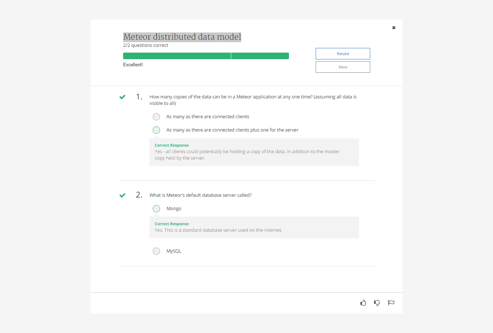
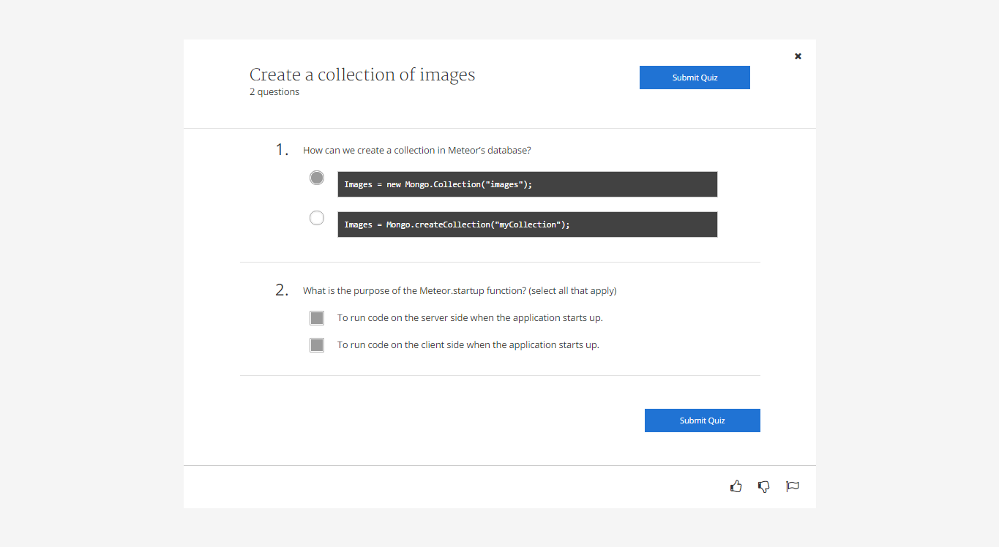
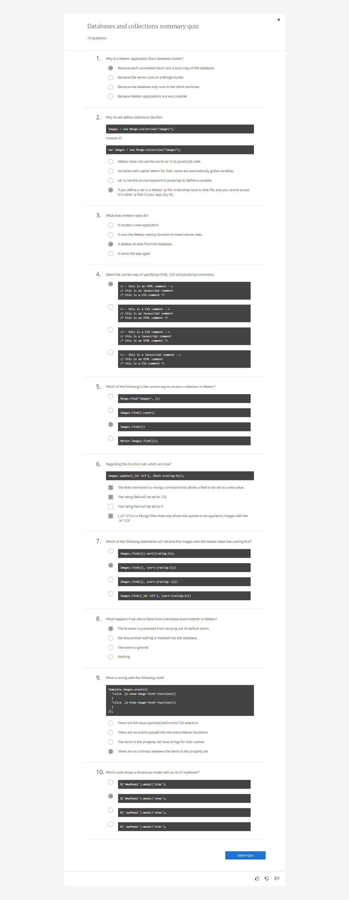

Databases and collections

Learning outcomes

By the end of the module you will be able to:

* Create Mongo Collections
* Use Mongo find and insert operations
* Control a Bootstrap modal from Meteor
* Use third party Meteor packages to add functionality

Meteor distributed data model
Quiz 1

Create a collection of images
Quiz 2

Removing items from a collection
Quiz 3

Summary Quiz 

